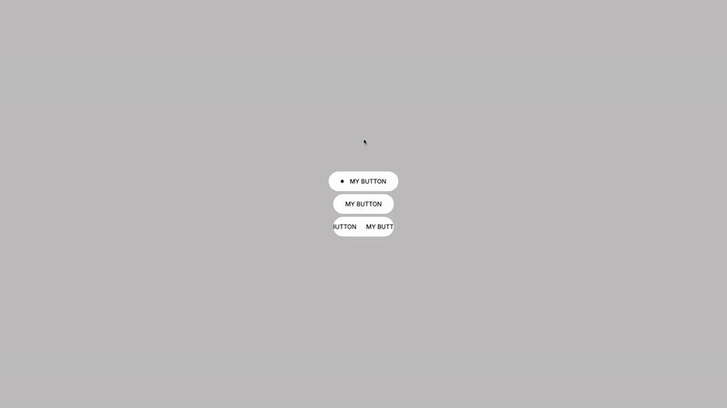

# Interactive Button Collection

A showcase of modern button interactions using React and CSS. This collection features three distinct interactive buttons with unique hover animations, showcasing different techniques for creating engaging user interfaces.



[Live Demo](https://floriansimunek.com/projects/creativebuttons) | [Github Repository](https://github.com/floriansimunek/Creative-Buttons) | [Inspiration 1](https://timestwo.design) | [Inspiration 2](https://hello.cuberto.com/) | [Inspiration 3](https://lusion.co/)

## Features

- Three distinct button variants with unique hover animations
- Pure CSS transitions and animations without external libraries
- Modular component architecture for easy reuse

## Technical Implementation

This project demonstrates several advanced front-end techniques:

- **CSS Transitions** for smooth, performant animations
- **CSS Transforms** for dynamic element positioning and scaling
- **CSS Modules** for component-scoped styling

## Project Structure

```
button-collection/
├── src/
│   ├── components/
│   │   ├── Button1/
│   │   │   ├── index.js
│   │   │   ├── Button1.jsx
│   │   │   └── Button1.module.css
│   │   ├── Button2/
│   │   │   ├── index.js
│   │   │   ├── Button2.jsx
│   │   │   └── Button2.module.css
│   │   ├── Button3/
│   │   │   ├── index.js
│   │   │   ├── Button3.jsx
│   │   │   └── Button3.module.css
│   ├── App.jsx
│   └── main.jsx
```

## Button Components

### Button 1: Expanding Dot

- Small dot expands to fill the button with blue background
- Text and arrow shift position and change to white
- Smooth transition using cubic-bezier timing function

### Button 2: Vertical Text Swap

- Main text slides upward while secondary text slides in from below
- Background changes from white to yellow
- Shape transforms from pill to rectangle

### Button 3: Scrolling Text with Letter Reveal

- Horizontal scrolling text in default state
- On hover, reveals text character by character with staggered timing
- Background transforms to black with white text appearing sequentially

## Key Technologies

- React
- CSS Modules
- CSS Animations and Transitions
